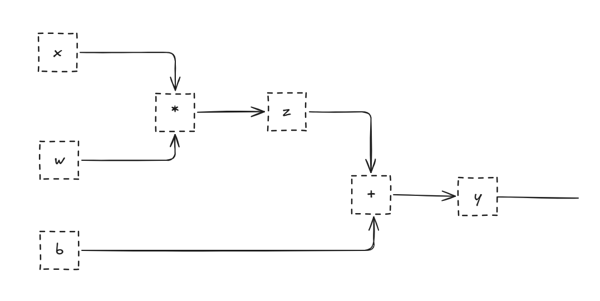
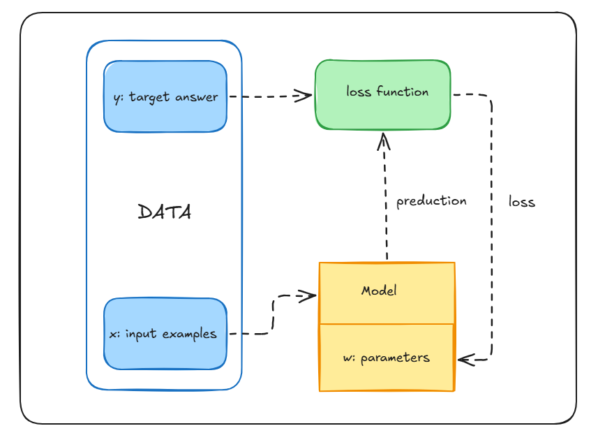
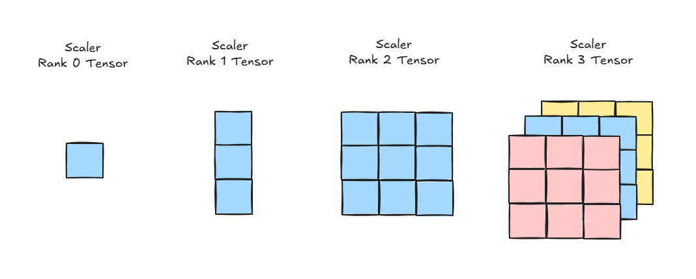

## What is NLP?

NLP refers to a set of techniques that apply statistical methods, with or without insights from linguistics, to understand text in order to solve real-world problems. Machines don't understand words like we human do they can just process numbers. So text has to be converted into a mathematical or structural representation, such as vectors, tensors, graphs and trees.

Learning from data to build representations that solve specific tasks is the domain of Machine Learning. Over the past decade, a subfield called Deep Learning has emerged and become the dominant approach.

## Deep learning and computational graphs

Deep learning automatically learns useful representations of data using computational graphs and numerical optimization. Framework like PyTorch make this implementation much easier. Instead of manually engineering features, deep learning models extract features automatically from the data.

### Computational graphs

A computational graph is an abstraction that models a mathematical expression. Framework PyTorch implement it and add extra bookkeeping for **automatic differentiation**, which computes the gradients needed to train the parameters.

A simple linear model, `y = wx + b`, can be split into two sub-expressions: `z = wx` and `y = z + b`. Drawn as a directed acyclic graph (DAG), the **nodes** are operations (multiplication, addition), the **incoming edges** are the inputs to an operation, and the **outgoing edge** is its output:



The input `x` is multiplied by the weights `w`, the bias `b` is added, and the result is the prediction `ŷ`.

**Inference** (prediction) is simply evaluating this expression: a forward flow through the graph.

## The supervised learning paradigm

Supervised learning trains a model on labeled data: input examples `x` and ground-truth targets `y`. In machine translation, for example, `x` is a sentence in the source language and `y` is its translation.

Here is the full workflow:



### The six core components

1. **Examples (`x`):** the input items or data points we make predictions for.
2. **Target answers (`y`):** the true labels that correspond to an observation.
3. **Model:** the mathematical function that maps an input `x` to a prediction.
4. **Parameters (`w`):** the adjustable weights that define the model's behavior.
5. **Predictions (`ŷ`):** the output values the model estimates.
6. **Loss function (`L(y, ŷ)`):** a measure of the gap between the prediction `ŷ` and the true target `y`. A lower loss means a more accurate model.

## Encoding input examples and targets

Machine learning and deep learning algorithms need numerical input. Before training, both the text (the observations) and the target labels must be converted into numerical vectors. This process is called **encoding**.

There are countless ways to do this, and much of deep learning is about _learning_ good representations from data. But we start with simple, count-based representations built on heuristics. They are simple, yet powerful enough to serve as a starting point for richer representations. All of them start with a vector of fixed dimension.

### One-hot representation

Start by building a vocabulary from the unique words in the sentences "I like cats" and "I like dogs". This gives a vocabulary of 4 words: `{i, like, cats, dogs}`.

Each word is represented by a 4-dimensional vector that is all zeros except for a single 1 at the word's position. For example, if "cats" is the 3rd word, its vector is `[0, 0, 1, 0]`.

A phrase can be represented in two ways:

- **Matrix form:** stack the one-hot vectors of its words into a matrix, one vector per word.
- **Collapsed (binary) form:** squash the phrase into a single vector the length of the vocabulary, where 1 means the word appears and 0 means it doesn't. This is a logical OR of the individual one-hot vectors. For example, "like cats" becomes `[0, 1, 1, 0]`.

**Limitations.** One-hot encoding makes simplifying assumptions:

- **No notion of meaning.** "cats" and "dogs" are both animals, but their vectors, `[0, 0, 1, 0]` and `[0, 0, 0, 1]`, contain nothing to show they are related. This is one reason richer representations such as word embeddings are useful.
- **Ambiguity is collapsed.** A word with several senses (like "flies" in "Time flies like an arrow" vs. "Fruit flies like a banana") gets one vector regardless of context.
- **Word order and counts are lost** in the collapsed form.

### TF (Term Frequency)

TF represents text by counting how many times each word appears. It is the **sum of the one-hot vectors** of the words in a sentence or document. Unlike one-hot encoding, which only records presence or absence, TF also captures frequency. We write the TF of a word `w` as `TF(w)`.

For example, take the sentence "I like cats and I like dogs", with the vocabulary extended to `{i, like, cats, dogs, and}`. Its TF vector is:

| Word  | i   | like | cats | dogs | and |
| ----- | --- | ---- | ---- | ---- | --- |
| Count | 2   | 2    | 1    | 1    | 1   |

That is `[2, 2, 1, 1, 1]`. TF is useful when the number of times a word appears carries information about the document.

### TF-IDF (Term Frequency-Inverse Document Frequency)

TF has a weakness: it weights words in proportion to how often they appear, but frequent words are often uninformative. In a collection of patent documents, words like "claim", "system" and "method" appear everywhere and say nothing about any specific patent. A rare word like "tetrafluoroethylene" appears less often but strongly signals what a patent is about, so it deserves a larger weight.

**Inverse Document Frequency (IDF)** is a heuristic that does exactly this: it penalizes common tokens and rewards rare ones.

```
TF-IDF(t, d) = TF(t, d) × IDF(t)
IDF(t)       = log(N / df(t))
```

- `TF(t, d)` is the number of times term `t` appears in document `d`.
- `N` is the total number of documents.
- `df(t)` is the number of documents containing term `t`.

Two edge cases show how it behaves:

1. **A word in every document** (`df(t) = N`): `log(1) = 0`, so IDF is 0 and the TF-IDF score is 0. The word is completely ignored.
2. **A word in only one document** (`df(t) = 1`): IDF is `log N`, the maximum possible value, so the word gets the biggest boost.

**Worked example.** Take a corpus of two documents, "I like cats" and "I like dogs" (`N = 2`):

- "i" and "like" appear in both documents, so `IDF = log(2/2) = 0`. They are zeroed out.
- "cats" and "dogs" each appear in one document, so `IDF = log 2 ≈ 0.69`. They get the highest weight.

That makes sense: "cats" and "dogs" are exactly the words that distinguish the two documents. (Libraries like scikit-learn use a slightly smoothed version of this formula, so exact numbers differ a little.)

TF-IDF has a long history in **information retrieval (IR)** and is still used in production NLP systems and search engines today.

### What deep learning does instead

In deep learning, heuristic encodings like TF-IDF are rarely used as inputs, because the goal is to _learn_ the representation. The usual approach is:

1. Represent each word as an **integer index** (a compact equivalent of a one-hot vector).
2. Pass the indices through an **embedding lookup layer** that constructs the input to the neural network.

### Target encoding

The targets need encoding too, and how depends on the task:

- **Text targets** (machine translation, summarization, question answering): the target is also text, encoded with approaches like one-hot encoding.
- **Categorical labels** (e.g., sentiment): usually encoded with a unique index per label. This becomes a problem when there are too many labels. Language modeling (predicting the next word) is the classic case, since the label space is the whole vocabulary and can reach hundreds of thousands of entries.
- **Numerical targets** (essay grade, readability score, star rating, age group): a reasonable approach is to put the values into **bins** (e.g., "0-18", "19-25", "25-30") and treat it as **ordinal classification**, a multiclass problem where the labels have an order. Binning can be uniform or data-driven, and this choice can strongly affect performance.

## PyTorch and Computational Graphs

PyTorch is an open-source, community-driven deep learning framework. It uses a tape-based [automatic differentiation](https://justindomke.wordpress.com/2009/03/24/a-simple-explanation-of-reverse-mode-automatic-differentiation/) method that allows users to define and execute computational graphs dynamically. This makes debugging significantly easier and simplifies constructing sophisticated models with minimal effort.

In contrast, frameworks like TensorFlow and Caffe require a computational graph to be declared, compiled, and then executed. While this static graph approach creates optimized implementations well-suited for deployment and production apps, it can be cumbersome during research and development.

Modern frameworks like PyTorch leverage dynamic computational graphs to allow a flexible development style without needing to compile the model before execution. This enables the model to build its computational graph on the fly while the program is running.

### Dynamic Graph Trade-offs & NLP Applications

- Dynamic computational graphs can be computationally expensive because inputs with different structures force the model to create a unique computational graph for each input.

- In Natural Language Processing , this flexibility is beneficial because inputs frequently vary in structure (e.g., two sentences with different lengths or syntactic structures generate individual computational graphs tailored to each sentence).

## Tensors in PyTorch

PyTorch is fundamentally an optimized tensor manipulation library. The core building block of the library is the **tensor**, which is a mathematical object representation used to hold multidimensional values.


### Tensor Definitions by Order

- **Order 0**: A tensor of order zero is just a scalar number.

- **Order 1**: A tensor of order 1 is a 1D array or vector.

- **Order 2**: A tensor of 2nd order is a matrix or an array of vectors.

- **Order n**: A tensor of n-dimensional order consists of multiple matrices/higher-dimensional arrays.

## References

- Rao, D. and McMahan, B. _Natural Language Processing with PyTorch_. O'Reilly Media.
