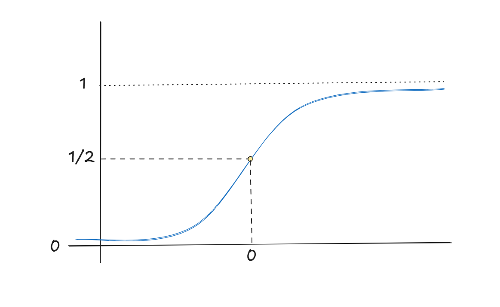
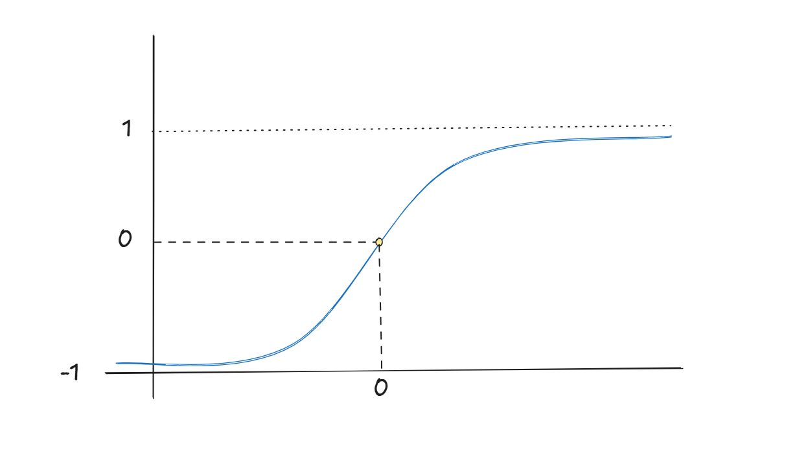
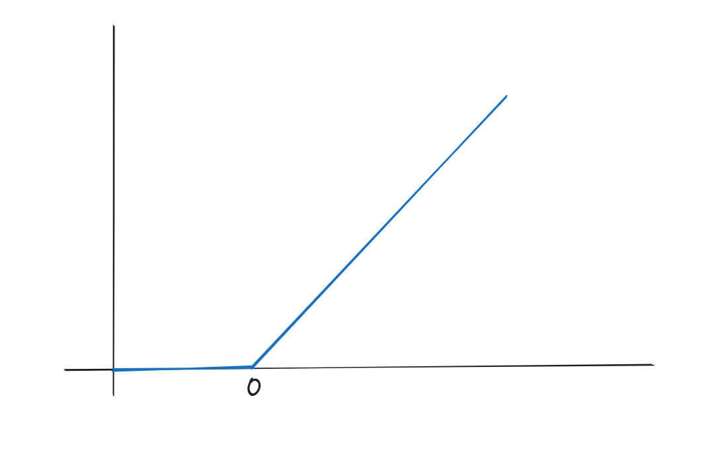
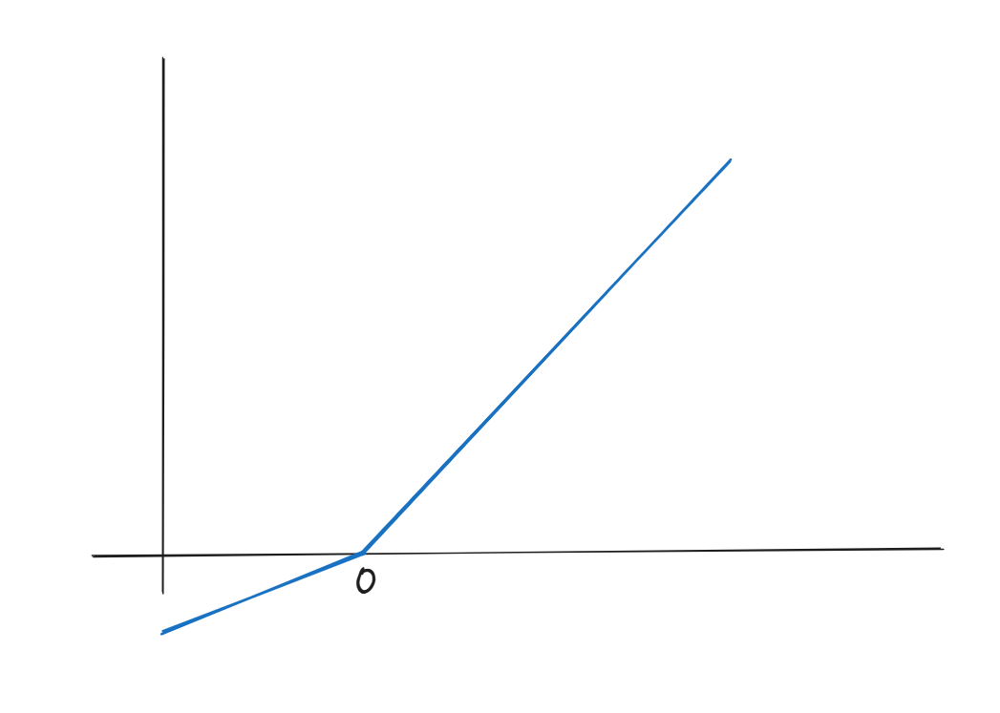
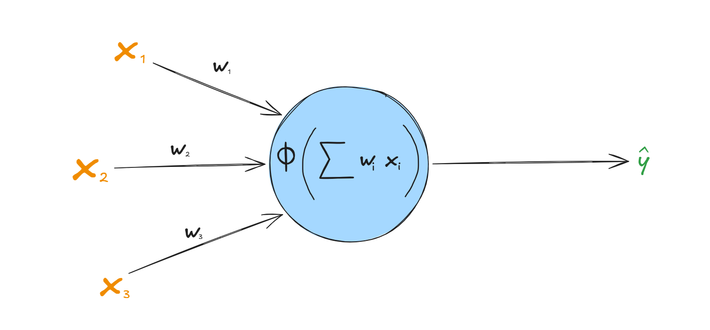
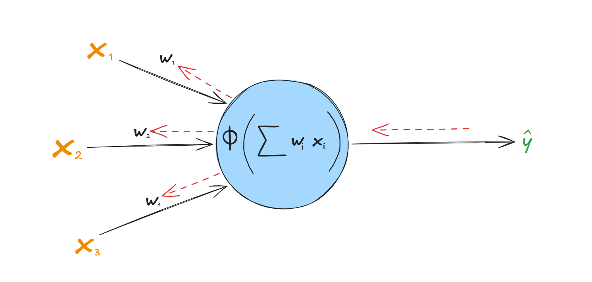

## Perceptron anatomy

The simplest neural network unit is a **perceptron**, inspired by the biological neuron. It receives inputs (`x`) and produces an output (`y`) using three main components: weights (`w`), a bias (`b`), and an activation function (`f`).

During training, the weights and bias are adjusted to minimize the loss function. The activation function is chosen based on the task and the desired output of the network.

Mathematically, we can express this as follows:

```
y = f(w·x + b)
```

Usually, a perceptron has multiple inputs. We can represent this general case using vectors:

```
y = f(wᵀx + b)
```

Here, `x` represents the input vector, and `w` represents the corresponding weights. Each weight determines how much its input contributes to the final result. The bias shifts the activation, letting the unit fire even when all inputs are zero.

## Activation functions

Activation functions introduce nonlinearity into neural networks, allowing them to learn complex relationships in data. Without them, stacking layers would be pointless: a chain of linear transformations is still just one linear transformation. Several activation functions are commonly used, each with its own advantages and limitations.

### Sigmoid

The sigmoid function takes any real number and maps it to a value between 0 and 1.

```
f(x) = 1 / (1 + e^(-x))
```



Sigmoid is commonly used in the output layer of binary classification networks because its output can be interpreted as a probability. However, it is rarely used in hidden layers of deep neural networks because its gradient becomes very small when the input is extremely positive or negative. This can cause the **vanishing gradient problem**, making it difficult to train earlier layers.

A handy property: its derivative can be written in terms of its own output, which makes backpropagation cheap.

```
f'(x) = f(x) · (1 - f(x))
```

### tanh

Like sigmoid, the hyperbolic tangent function (`tanh`) maps real numbers to a bounded range, but its output lies between -1 and 1.

```
f(x) = tanh(x)
```



Unlike sigmoid, tanh is zero-centered, which can sometimes make optimization easier. However, its gradient can also become very small for large positive or negative inputs, leading to the vanishing gradient problem.

### ReLU

ReLU stands for **Rectified Linear Unit**. It is one of the most widely used activation functions in deep learning, particularly in hidden layers.

```
f(x) = max(0, x)
```



ReLU outputs zero for negative inputs and returns the input unchanged for positive inputs. Its simple computation and non-saturating positive region help reduce the vanishing gradient problem compared with sigmoid and tanh.

However, ReLU can suffer from the **dying ReLU problem**: if a neuron's inputs consistently fall in the negative region, its gradient becomes zero, and the neuron may stop learning.

To mitigate this issue, variants such as Parametric ReLU (PReLU) allow a small, learnable slope for negative inputs.

```
f(x) = max(x, a·x)
```

Here, `a` is a learnable parameter, typically between 0 and 1 (the form `max(x, a·x)` only behaves like a "leaky" ReLU in that range). When `a` is fixed to a small constant such as 0.01, this is called **Leaky ReLU**.



### Softmax

The activations above work on a single number. For multi-class classification, the output layer usually uses **softmax**, which turns a vector of raw scores (logits) `z` into probabilities that sum to 1:

```
softmax(zᵢ) = e^(zᵢ) / (e^(z₁) + e^(z₂) + ... + e^(zₖ))
```

Here, `K` is the number of classes. The largest score gets the largest probability, but every class keeps a nonzero share.

## Loss functions

A loss function measures how far a model's prediction is from the expected output. During training, the network tries to minimize this loss by adjusting its weights and biases.

For example, the **Mean Squared Error (MSE)** measures the average squared difference between predicted and actual values:

```
L = (1/n) · Σ (yᵢ - ŷᵢ)²      for i = 1 ... n
```

Here, `yᵢ` is the actual value, `ŷᵢ` is the predicted value, and `n` is the number of samples.

MSE is commonly used for regression tasks. For classification, cross-entropy loss is often more appropriate because it measures how well the predicted class probabilities match the actual classes.

For binary classification, **binary cross-entropy** is:

```
L = -(1/n) · Σ [ yᵢ·log(ŷᵢ) + (1 - yᵢ)·log(1 - ŷᵢ) ]      for i = 1 ... n
```

For `K` classes with one-hot labels, **categorical cross-entropy** is:

```
L = -(1/n) · Σᵢ Σₖ yᵢₖ · log(ŷᵢₖ)      for i = 1 ... n and k = 1 ... K
```

Cross-entropy punishes confident wrong predictions very heavily, which gives stronger gradients than MSE when a sigmoid or softmax output is far off.

## Gradient descent

Gradient descent is an optimization algorithm used to minimize the loss function. It adjusts the model's weights and biases in the direction that reduces the loss.

The update rule for a weight is:

```
w ← w - η · (∂L/∂w)
```

Here, `η` (eta) is the learning rate, which controls the size of each update, and `∂L/∂w` is the gradient of the loss with respect to the weight.

A large learning rate may cause the model to overshoot the minimum, while a very small learning rate can make training slow.

In practice, the gradient is rarely computed on the whole dataset at once. **Stochastic gradient descent (SGD)** uses one example per update, and **mini-batch gradient descent** uses a small group of examples. Optimizers such as Adam build on this idea by adapting the step size for each parameter.

## Putting it all together: how a perceptron learns

Training a neural network involves repeatedly making predictions, measuring errors, and adjusting the parameters to improve future predictions.

### Forward propagation

During forward propagation, the perceptron calculates the weighted sum of its inputs, adds the bias, and applies the activation function to produce a prediction:



```
ŷ = f(wᵀx + b)
```

### Loss calculation

The predicted output is compared with the actual target using a loss function. The resulting loss indicates how far the prediction is from the expected answer.

### Backpropagation

Backpropagation calculates the gradients of the loss with respect to the network's weights and biases using the chain rule. These gradients tell us how each parameter contributes to the error.



### Parameter update

An optimizer, such as gradient descent, uses these gradients to update the weights and biases. The process repeats over many training examples until the model learns useful patterns from the data.

In short, **forward propagation makes predictions, the loss function measures errors, backpropagation calculates gradients, and gradient descent updates the parameters.**

## A worked example

Let's do one full training step by hand. Take a single sigmoid perceptron with one input, using MSE loss on one sample:

- Input `x = 2`, target `y = 1`
- Initial weight `w = 0.5`, bias `b = 0`
- Learning rate `η = 0.1`

**Forward pass.**

```
z = w·x + b = 0.5 · 2 + 0 = 1
ŷ = sigmoid(1) ≈ 0.7311
```

**Loss.**

```
L = (y - ŷ)² = (1 - 0.7311)² ≈ 0.0723
```

**Backward pass.** Apply the chain rule:

```
∂L/∂w = (∂L/∂ŷ) · (∂ŷ/∂z) · (∂z/∂w)
```

Each piece:

```
∂L/∂ŷ = -2(y - ŷ) ≈ -0.5379
∂ŷ/∂z = ŷ(1 - ŷ) ≈ 0.1966
∂z/∂w = x = 2
∂z/∂b = 1
```

Multiplying these together:

```
∂L/∂w ≈ -0.5379 · 0.1966 · 2 ≈ -0.2115
∂L/∂b ≈ -0.5379 · 0.1966 · 1 ≈ -0.1058
```

**Update.**

```
w ← 0.5 - 0.1 · (-0.2115) ≈ 0.5212
b ← 0 - 0.1 · (-0.1058) ≈ 0.0106
```

**Check.** With the new parameters, `z ≈ 1.053`, so `ŷ ≈ 0.7413` and `L ≈ 0.0669`. The prediction moved closer to the target and the loss dropped from 0.0723 to 0.0669. Repeat this thousands of times and the loss keeps shrinking.

## Implementing it in code

Here is the same idea in NumPy, training a perceptron to learn the logical AND function with sigmoid and binary cross-entropy. (With cross-entropy, the gradient of the loss with respect to `z` simplifies neatly to `ŷ - y`.)

```python
import numpy as np

def sigmoid(z):
    return 1 / (1 + np.exp(-z))

# AND gate dataset
X = np.array([[0, 0], [0, 1], [1, 0], [1, 1]], dtype=float)
y = np.array([0, 0, 0, 1], dtype=float)

rng = np.random.default_rng(0)
w = rng.normal(size=2)
b = 0.0
lr = 0.5

for epoch in range(2000):
    # forward propagation
    z = X @ w + b
    y_hat = sigmoid(z)

    # loss (binary cross-entropy)
    eps = 1e-9
    loss = -np.mean(y * np.log(y_hat + eps) + (1 - y) * np.log(1 - y_hat + eps))

    # backpropagation
    dz = (y_hat - y) / len(y)
    dw = X.T @ dz
    db = dz.sum()

    # parameter update
    w -= lr * dw
    b -= lr * db

    if epoch % 500 == 0:
        print(f"epoch {epoch:4d}  loss {loss:.4f}")

print(np.round(sigmoid(X @ w + b)))  # -> [0. 0. 0. 1.]
```

## Limits of a single perceptron

A single perceptron draws one straight line (a hyperplane in higher dimensions) to separate classes. That works for AND and OR, but it cannot solve problems that are not **linearly separable**, such as XOR. This limitation was a major reason early neural network research stalled in the 1960s.

## From one neuron to many: multi-layer networks

The fix is to stack perceptrons into layers. A **multi-layer perceptron (MLP)** has an input layer, one or more hidden layers, and an output layer. Each layer applies a linear transformation followed by an activation function:

```
h = f₁(W₁x + b₁)
ŷ = f₂(W₂h + b₂)
```

Here, `W₁` and `W₂` are weight matrices, and each row holds the weights of one neuron. Thanks to the nonlinear activation in the hidden layer, even a small MLP can solve XOR, and with enough hidden units it can approximate a very wide range of functions. Training works exactly as before: forward propagation, loss, backpropagation (the chain rule now runs through every layer), and a parameter update.

## Key takeaways

- A perceptron computes a weighted sum of its inputs, adds a bias, and applies an activation function.
- Nonlinear activations are what let networks learn complex patterns; ReLU is the default for hidden layers, sigmoid and softmax for classification outputs.
- A loss function measures error: MSE for regression, cross-entropy for classification.
- Backpropagation computes gradients with the chain rule, and gradient descent uses them to update parameters.
- Single perceptrons are limited to linear problems; stacking layers removes that limit.
